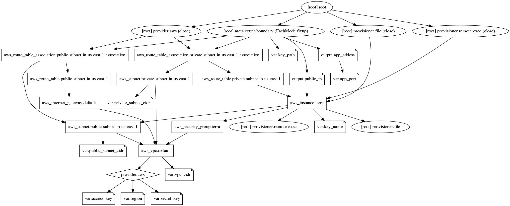

# terraform-aws

# Steps

Automation to deploy [this application](https://github.com/spring-projects/spring-petclinic) on Amazon without any manual intervention, just copy the app address at the end and paste in the browser to access it.

- Deploy a complete VPC (gateway, networks, route, sg, vpc)
- Deploy Amazon Instance
- Access instance and
  - Install some packages and docker and jenkins
- Install jenkins container and
  - Create pipeline to deploy petclinic-app
  - Build the job
  - Get the result
- Show the pet-clinic address
- And we're done
